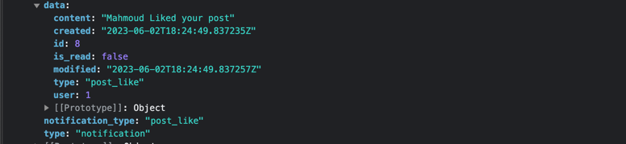

# Usage

## 1. create notification events

```python

from notifications.handlers import send_message

send_message('Mahmoud Liked your post', user, 'post_like')
```
Explain
```python
# function interface
send_message(message:str, user:User, type:str)

# logic behind it
message: the text message to be sent to the user
user: an instance of User model (the one who will recieve the notification)
type: is a notification tag (you should create difrrent types in your system for different events)
```
## 2.fetch notifications using REST APIs

``notifications/all/``:GET : get all the notifications


<br/><br/><br/>
``notifications/mark/``:PUT : mark all notifications as read


<br/><br/><br/>

``notifications/unread/``:GET: get all unread notifications


# configration

Note: make sure that django chanels is up and runnnig and also you django serves under ASGI

``` python
INSTALLED_APPS = [
    ...
    'channels', # django channels needs to be installed
    'notifications', # our package
    ...   
]
```


```python

SIMPLE_NOTIFICATION_SETTINGS = {
    'receive_handler_path': 'custom_module.custom_py_file.custom_receive_handler',
}
```

```python
AUTH_USER_MODEL = "users.User"
```

```python
    path('api/v1/notifications/', include('notifications.urls')),
```


